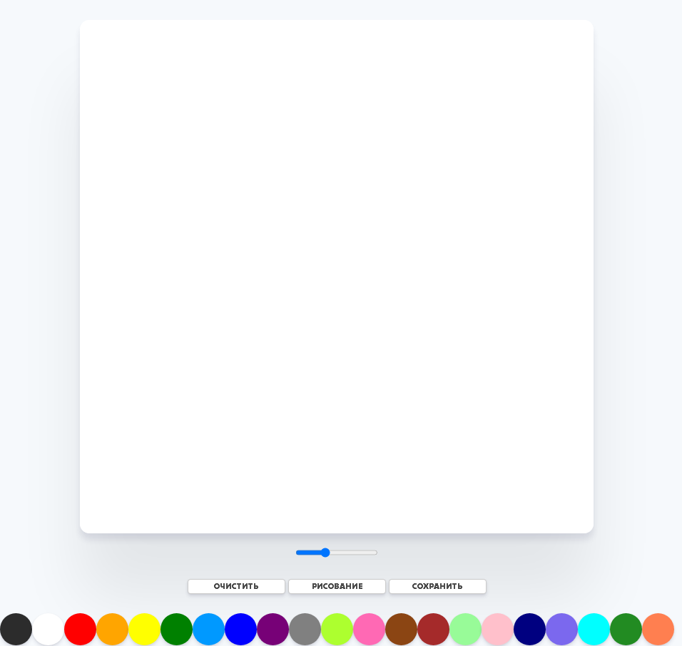
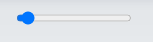
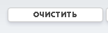
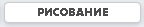
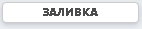
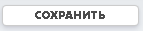

<h1 align="center"> PaintClone </h1>
<h3 align="center"> Руководство по использованию </h3>

---

---

1)  <b>Ползунок</b>
  
 - Используется для регулировки ширины кисти 
2) <b> Кнопка "Очистить"</b>
  
 - Используется для очистки листа рисования 
3) <b> Кнопка "Заливка"-"Рисование"</b>
   
 - Используется для переключения режимов на заливку или рисование,показывает текущий режим рисования, при нажатии режим меняется. 
4) <b> Кнопка "Сохранить"</b>
  
 - Используеться для сохранения рисунка <b>(.png)</b> 
5) <b>Палитра цветов</b>
  
 -Используеться для выбора цвета кисти 
___
<i>Разработчик: Дранишников Дмитрий Александрович
Студент Ноябрьского Колледжа Профессиональных и Информационных технологий
</i>
